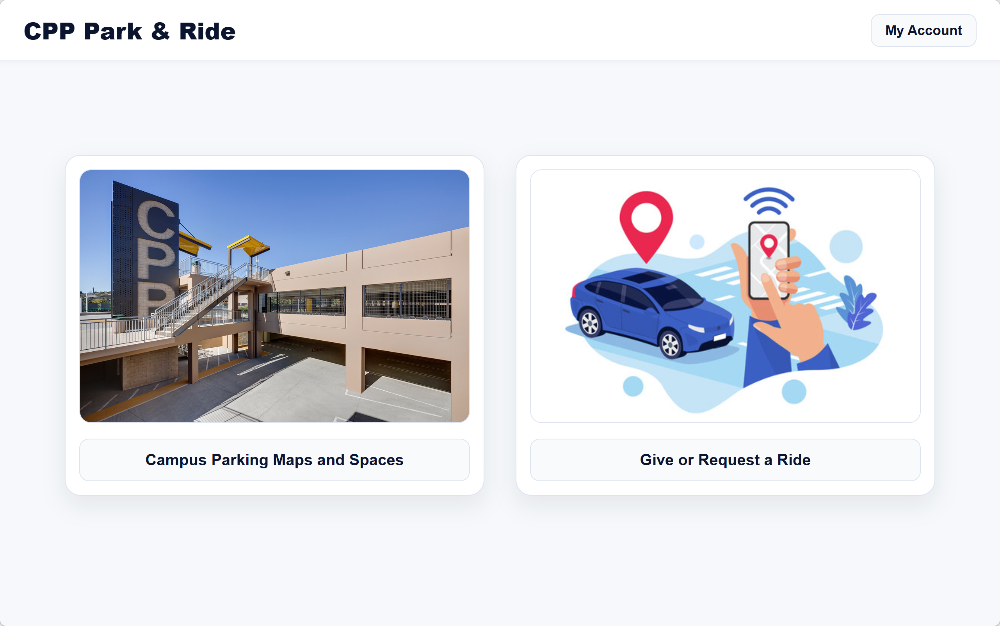

# CPP Park & Ride

## Description

CPP Park & Ride is a web application designed for the Cal Poly Pomona community to help with campus transportation. It provides services for finding parking spaces and arranging ride-sharing.

## Features

*   **Campus Parking:** View campus parking maps and information on available spaces.
*   **Ride-Sharing:** Users can offer a ride or request a ride from other users.
*   **User Accounts:** Basic user account functionality.
*   **Chat:** A chat feature for users to communicate.

## How to Use

1.  Open `login.html` to start.
2.  From the home page, you can navigate to the parking or ride-sharing sections.
3.  Use the navigation to access other features like your account or chat.

## File Structure

-   `login.html`: The login page.
-   `home.html`: The main page after logging in.
-   `parking.html`: Displays parking maps and information.
-   `ride.html`: The main page for ride-sharing.
-   `giveride.html`: Form to offer a ride.
-   `myaccount.html`: User account page.
-   `chat.html`: Chat interface.
-   `styles.css`: Contains the styles for the application.
-   `script.js`: Contains the JavaScript for the application.
-   `images/`: Folder for images used in the application.
